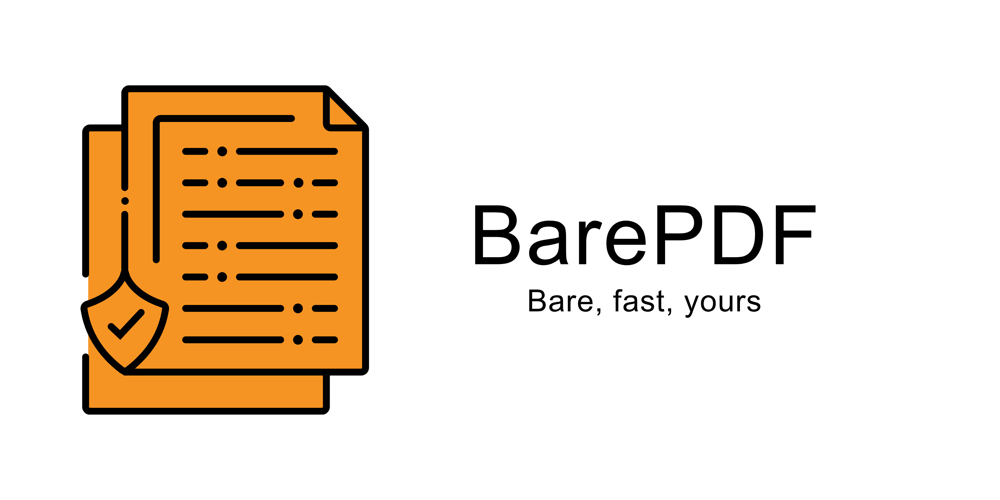
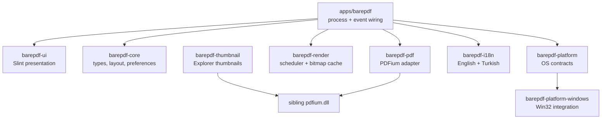

<a id="barepdf"></a>
<div align="center">
  <picture>
    <source media="(prefers-color-scheme: dark)" srcset="./assets/banner-dark.png">
    <source media="(prefers-color-scheme: light)" srcset="./assets/banner-white.png">
    
  </picture>

  <h1>BarePDF</h1>
  <p><strong>Fast, private PDF reading for Windows.</strong></p>

  [](https://github.com/Woffluon/BarePDF/releases/latest)
  [](https://github.com/Woffluon/BarePDF/actions/workflows/ci.yml)
  [](https://woffluon.github.io/BarePDF/docs/)
  [](#system-requirements)
  [](./LICENSE)

  [Download](https://woffluon.github.io/BarePDF/download/) ·
  [Documentation](https://woffluon.github.io/BarePDF/docs/) ·
  [Changelog](https://woffluon.github.io/BarePDF/changelog/) ·
  [Report a bug](https://github.com/Woffluon/BarePDF/issues/new) ·
  [Contribute](#contributing)
</div>

---

BarePDF is an open-source PDF reader built for Windows 10 and 11 with Rust, Slint, and PDFium. It keeps document work local, starts with no telemetry or account requirements, and uses demand-driven rendering with bounded caches so memory use does not grow unchecked with document length.

## Contents

- [Why BarePDF](#why-barepdf)
- [Download](#download)
- [Quick start](#quick-start)
- [Features](#features)
- [System requirements](#system-requirements)
- [Updates and release security](#updates-and-release-security)
- [Keyboard shortcuts](#keyboard-shortcuts)
- [Developer guide](#developer-guide)
- [Architecture](#architecture)
- [Testing](#testing)
- [Packaging and releases](#packaging-and-releases)
- [Contributing](#contributing)
- [Privacy, security, and license](#privacy-security-and-license)

## Why BarePDF

| Principle | What it means |
| --- | --- |
| **Fast by design** | Visible pages receive priority; stale render work is cancelled before rasterization. |
| **Bounded resources** | Byte-budgeted LRU caches and demand-driven thumbnails prevent unbounded bitmap growth. |
| **Offline first** | Reading PDFs needs no account, cloud service, analytics, or telemetry. |
| **Native Windows integration** | Installer registration, “Open with”, file drops, clipboard access, high-DPI behavior, and Default Apps flow use Windows conventions. |
| **Focused interface** | Reading controls remain accessible without covering the document canvas. |
| **Auditable releases** | Update metadata is Ed25519-signed; downloaded installers are checked for URL, size, SHA-256, and embedded version. |

## Download

Use the [official download page](https://woffluon.github.io/BarePDF/download/). It reads the latest stable GitHub Release and presents one canonical installer, one portable archive, and one checksum manifest.

| I want to… | Choose | Notes |
| --- | --- | --- |
| Install BarePDF normally | `BarePDF-Setup-x64-vX.Y.Z.exe` | Recommended. Installs per-user without administrator rights. |
| Run without installation | `BarePDF-Portable-x64-vX.Y.Z.zip` | Extract anywhere, then run `BarePDF.exe`. No installer registry changes. |
| Verify a download | `BarePDF-vX.Y.Z-SHA256SUMS.txt` | Contains SHA-256 values for installer and portable package. |

> [!IMPORTANT]
> The installer is intentionally not Authenticode-signed. Windows may show an **Unknown publisher** warning. Download only from the official BarePDF site or [`Woffluon/BarePDF` releases](https://github.com/Woffluon/BarePDF/releases/latest), then verify the checksum if desired.

### What the other release files are

Each BarePDF release publishes exactly five project-owned assets:

| File | Purpose | Normal users need it? |
| --- | --- | :---: |
| `BarePDF-Setup-x64-vX.Y.Z.exe` | Windows installer | Yes |
| `BarePDF-Portable-x64-vX.Y.Z.zip` | Portable application | Optional |
| `BarePDF-vX.Y.Z-SHA256SUMS.txt` | Installer and portable checksums | Optional |
| `latest.json` | Signed updater metadata | No |
| `latest.json.sig` | Ed25519 signature for `latest.json` | No |

GitHub also adds **Source code (zip)** and **Source code (tar.gz)** automatically. Those archives contain source code, not a ready-to-run Windows application.

### Verify a download

```powershell
$Installer = Get-Item .\BarePDF-Setup-x64-v*.exe
Get-FileHash -Algorithm SHA256 -LiteralPath $Installer.FullName
```

Compare the result with the matching entry in `BarePDF-vX.Y.Z-SHA256SUMS.txt` from the same release.

## Quick start

### Installer

1. Open the [download page](https://woffluon.github.io/BarePDF/download/).
2. Download the single `BarePDF-Setup-x64-vX.Y.Z.exe` file.
3. Run it and complete the per-user installation.
4. Optionally let setup open Windows **Default Apps** settings, then select BarePDF for `.pdf` files.
5. Open a PDF with `Ctrl+O`, drag it into the window, or double-click it in File Explorer.

Default install location:

```text
%LOCALAPPDATA%\Programs\BarePDF
```

### Portable

1. Download `BarePDF-Portable-x64-vX.Y.Z.zip` from the same page.
2. Extract the archive to a writable folder or USB drive.
3. Run `BarePDF.exe`.

## Features

### Reading and navigation

- Continuous vertical and single-page viewing modes.
- Page-number navigation with bounded input validation.
- Fit width, fit page, custom zoom, and keyboard zoom controls.
- Full-screen (`F11`) and presentation (`F5`) modes.
- Page thumbnails and hierarchical document outline navigation.
- Password prompt for encrypted PDFs.
- Recent-file list for quick reopening.
- File opening through dialog, command line, File Explorer, and drag-and-drop.

### Text and interface

- Mouse text selection backed by PDFium glyph geometry.
- Double-click word selection, triple-click line selection, and `Ctrl+C` clipboard copy.
- System, light, and dark themes.
- English, Turkish, and system-language modes.
- High-DPI rendering for dense and mixed-scale displays.
- Responsive toolbar and collapsible sidebar.

### Rendering behavior

- One isolated PDFium actor owns document access.
- High- and low-priority render queues keep visible pages responsive.
- Duplicate requests are coalesced.
- Generation tokens reject stale work after navigation or document replacement.
- Raw and UI bitmap caches use explicit byte budgets.
- Thumbnail dimensions preserve page aspect ratio.

## System requirements

| Requirement | Supported configuration |
| --- | --- |
| Operating system | Windows 10 or Windows 11 |
| Architecture | 64-bit x86 (`x86_64`) |
| Memory | 512 MB minimum; 1 GB recommended |
| Storage | Approximately 50 MB for installed files |
| Network | Not required for reading; optional for update checks |

## Updates and release security

BarePDF stays offline until the user chooses whether to enable update checks. When enabled:

1. The application checks at most once every 24 hours.
2. It downloads `latest.json` and `latest.json.sig` from the official GitHub Release endpoint.
3. It verifies the manifest with the Ed25519 public key pinned in the application.
4. Installed builds download a newer installer in the background.
5. Before offering installation, BarePDF verifies the exact release URL, file size, SHA-256, and embedded Windows file version.
6. Installation starts only after explicit user action. Portable builds link to the release instead of replacing themselves.

The release workflow fails closed if the private signing key is absent or does not match the pinned public key. Invalid signatures, untrusted redirects, partial downloads, same-version reinstalls, and downgrades are rejected.

> [!NOTE]
> Manifest signing protects BarePDF's update channel without an Authenticode certificate. It does not suppress Windows' **Unknown publisher** prompt.

## Keyboard shortcuts

| Action | Shortcut |
| --- | --- |
| Open document | `Ctrl+O` |
| Previous page | `PageUp` or `←` |
| Next page | `PageDown` or `→` |
| Zoom in | `+` or `Ctrl++` |
| Zoom out | `-` or `Ctrl+-` |
| Copy selected text | `Ctrl+C` |
| Full screen | `F11` |
| Presentation mode | `F5` |
| Exit full screen or presentation | `Esc` |
| Submit password | `Enter` in password dialog |

Full reference: [Keyboard shortcuts documentation](https://woffluon.github.io/BarePDF/docs/user/keyboard-shortcuts/).

## Developer guide

### Prerequisites

- Windows 10 or 11 on x64.
- [Rust](https://www.rust-lang.org/tools/install) 1.92 or newer with Cargo.
- Visual Studio 2022 Build Tools with Windows SDK and C++ tools.
- [Node.js](https://nodejs.org/) 22.12 or newer and pnpm 10 for the website.
- [Inno Setup](https://jrsoftware.org/isinfo.php) only when building the installer.

### Clone and run the desktop app

```powershell
git clone https://github.com/Woffluon/BarePDF.git
cd BarePDF

# Download the pinned PDFium build and verify its repository checksum.
powershell -File packaging/windows/scripts/fetch-pdfium.ps1 `
  -Destination target/debug/pdfium.dll

cargo run --package barepdf
```

BarePDF resolves `pdfium.dll` beside the application executable. The fetch script downloads a pinned archive over HTTPS and rejects a checksum mismatch.

### Run the website

```powershell
pnpm --dir website install --frozen-lockfile
pnpm --dir website run dev
```

Website source lives in [`website/`](./website). Production pages are static Astro output deployed through GitHub Pages.

## Architecture



| Path | Responsibility |
| --- | --- |
| [`apps/barepdf`](./apps/barepdf) | Executable entry point, preference loading, update orchestration, event-loop wiring |
| [`crates/barepdf-core`](./crates/barepdf-core) | Engine-independent types, layout calculations, selection, preferences |
| [`crates/barepdf-pdf`](./crates/barepdf-pdf) | PDF traits and PDFium-backed document implementation |
| [`crates/barepdf-render`](./crates/barepdf-render) | Priority scheduler, cancellation, deduplication, bitmap caches |
| [`crates/barepdf-ui`](./crates/barepdf-ui) | Slint components, toolbar, document canvas, sidebar, dialogs |
| [`crates/barepdf-platform`](./crates/barepdf-platform) | Platform service contracts |
| [`crates/barepdf-platform-windows`](./crates/barepdf-platform-windows) | Windows dialogs, clipboard, file drops, registry helpers, update verification |
| [`crates/barepdf-i18n`](./crates/barepdf-i18n) | Language selection and complete translation tables |
| [`crates/barepdf-thumbnail`](./crates/barepdf-thumbnail) | Windows Explorer thumbnail provider |
| [`packaging/windows`](./packaging/windows) | Inno Setup definition and deterministic packaging scripts |
| [`website`](./website) | Astro website, user docs, developer docs, release data integration |

## Testing

Run the complete pre-release validation from the repository root:

```powershell
cargo fmt --all --check
cargo clippy --workspace --all-targets --all-features --locked -- -D warnings
cargo test --workspace --all-features --locked
cargo audit --deny warnings

pnpm --dir website run test
pnpm --dir website exec astro check
pnpm --dir website run build
```

CI also builds and validates a real Windows installer, exercises silent install/uninstall behavior, checks registry configuration, and verifies the canonical release asset set.

## Packaging and releases

Product version has one source of truth: `[workspace.package].version` in [`Cargo.toml`](./Cargo.toml). Workspace crates, UI metadata, installer metadata, artifact names, tags, manifests, and website data derive from it.

### Build Windows packages locally

```powershell
powershell -File packaging/windows/scripts/fetch-pdfium.ps1
powershell -File packaging/windows/scripts/stage-release.ps1
powershell -File packaging/windows/scripts/build-portable.ps1
powershell -File packaging/windows/scripts/build-installer.ps1
powershell -File packaging/windows/scripts/validate-installer.ps1
powershell -File packaging/windows/scripts/generate-checksums.ps1
powershell -File packaging/windows/scripts/test-release-manifest.ps1
```

Final unsigned artifacts are written to `target/release/artifacts/`. GitHub Actions adds `latest.json.sig` before publication.

### Version policy

BarePDF uses Conventional Commits to determine SemVer changes:

| Commit | Version effect |
| --- | --- |
| `feat!:` or `BREAKING CHANGE:` | Major |
| `feat:` | Minor |
| `fix:`, `perf:`, `refactor:`, `build:`, `security:` | Patch |
| `docs:`, `ci:`, `test:`, `chore:` | No product-version change |

Before committing, use the exact same full commit message for preparation and validation:

```powershell
$CommitMessage = "fix(scope): describe the change"
powershell -File scripts/prepare-version.ps1 -Message $CommitMessage
powershell -File packaging/windows/scripts/validate-version.ps1 -Message $CommitMessage
```

After successful `main` CI, release discovery publishes the newest unreleased version, signs update metadata, marks the release as latest, and explicitly refreshes GitHub Pages. Older releases remain immutable.

More detail: [Packaging documentation](https://woffluon.github.io/BarePDF/docs/developer/packaging/) and [clean-Windows release checklist](./docs/RELEASING.md).

## Contributing

1. Read [`AGENTS.md`](./AGENTS.md) and the [developer documentation](https://woffluon.github.io/BarePDF/docs/developer/).
2. Create a focused branch from `main`.
3. Keep changes surgical and add the smallest regression test that proves non-trivial behavior.
4. Run the relevant checks from [Testing](#testing).
5. Use a valid Conventional Commit message.
6. Open a pull request with problem, solution, and verification notes.

Issues and focused pull requests are welcome:

- [Report a bug](https://github.com/Woffluon/BarePDF/issues/new)
- [Browse open issues](https://github.com/Woffluon/BarePDF/issues)
- [Open pull requests](https://github.com/Woffluon/BarePDF/pulls)

## Privacy, security, and license

- No telemetry, analytics, advertisements, AI services, or user accounts.
- PDF reading works offline.
- Update traffic remains disabled until the user opts in.
- Security-sensitive release validation fails closed.
- Native PDFium packages are pinned and checksum-verified before staging.

Please report suspected vulnerabilities privately through [GitHub Security Advisories](https://github.com/Woffluon/BarePDF/security/advisories/new) rather than a public issue.

BarePDF is distributed under the [MIT License](./LICENSE). Third-party components and notices are documented in [`THIRD_PARTY_NOTICES.md`](./THIRD_PARTY_NOTICES.md).

---

<div align="center">
  <strong>Bare. Fast. Yours.</strong><br>
  <a href="#barepdf">Back to top ↑</a>
</div>
