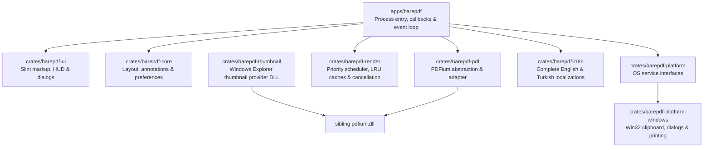

<a id="barepdf"></a>
<div align="center">
  <picture>
    <source media="(prefers-color-scheme: dark)" srcset="./assets/banner-dark.png">
    <source media="(prefers-color-scheme: light)" srcset="./assets/banner-white.png">
    
  </picture>

  <h1>BarePDF</h1>
  <p><strong>Fast, private PDF reader for Windows 10 and 11.</strong></p>

  [](https://github.com/Woffluon/BarePDF/releases/latest)
  [](https://github.com/Woffluon/BarePDF/actions/workflows/ci.yml)
  [](https://woffluon.github.io/BarePDF/docs/)
  [](#system-requirements)
  [](./LICENSE)

  [Download](https://woffluon.github.io/BarePDF/download/) ·
  [Documentation](https://woffluon.github.io/BarePDF/docs/) ·
  [Benchmarks](./docs/BENCHMARKS.md) ·
  [Changelog](https://woffluon.github.io/BarePDF/changelog/) ·
  [Report a bug](https://github.com/Woffluon/BarePDF/issues/new) ·
  [Contribute](#contributing)

  [English](README.md) · [Türkçe](README.tr.md)
</div>

---

BarePDF is an open-source PDF reader for Windows 10 and 11 built with Rust, Slint, and Google PDFium. It handles documents locally on your CPU, enforces a verified zero-telemetry policy, and uses demand-driven rendering with byte-budgeted LRU caches so memory usage remains bounded regardless of document length.

## Contents

- [Why BarePDF](#why-barepdf)
- [Installation and Downloads](#installation-and-downloads)
- [Core Features](#core-features)
- [Keyboard Shortcuts](#keyboard-shortcuts)
- [Architecture](#architecture)
- [Performance Benchmarks](#performance-benchmarks)
- [System Requirements](#system-requirements)
- [Zero Telemetry and Release Security](#zero-telemetry-and-release-security)
- [Developer Guide](#developer-guide)
- [Testing](#testing)
- [Packaging and Releases](#packaging-and-releases)
- [Contributing](#contributing)
- [Privacy and License](#privacy-and-license)

## Why BarePDF

| Principle | Technical Reality |
| --- | --- |
| **Fast by design** | Priority-queued render pipeline. Only visible viewport pages receive CPU rasterization; obsolete scroll jobs cancel immediately via generation tokens. |
| **Bounded memory** | Byte-budgeted LRU bitmap caches (32 MB raw, 16 MB UI, 4 MB thumbnails) prevent memory from growing unchecked on 500+ page documents. |
| **Zero telemetry** | 100% offline. Zero background analytics, zero tracking IDs, zero account requirements, zero network calls during reading. |
| **Native Windows integration** | Native Win32 printing, high-DPI handling, Shell thumbnail extension for File Explorer, and standard Default Apps registration. |
| **Full keyboard control** | Quick command palette HUD (`Ctrl+K`), custom viewing modes, and dedicated single-key shortcuts. |
| **Cryptographic security** | Update manifests are signed with Ed25519; download packages are verified against SHA-256 hashes and embedded PE version metadata. |

## Installation and Downloads

You can install BarePDF through the Windows Package Manager (WinGet), use the standalone setup installer, or run the portable zero-install archive.

### 1. Windows Package Manager (WinGet)

Install directly from PowerShell or Windows Terminal:

```powershell
winget install Woffluon.BarePDF
```

### 2. Windows Setup Installer

Download `BarePDF-Setup-x64-vX.Y.Z.exe` from the [official download page](https://woffluon.github.io/BarePDF/download/) or [GitHub Releases](https://github.com/Woffluon/BarePDF/releases/latest).

- Runs per-user without requiring administrator privileges.
- Default path: `%LOCALAPPDATA%\Programs\BarePDF`.
- Registers file associations cleanly in Windows Default Apps and "Open with" menus.
- Installs the native Windows Explorer thumbnail provider DLL.

### 3. Portable Archive

Download `BarePDF-Portable-x64-vX.Y.Z.zip` for a zero-install deployment.

- Extract to any directory or USB drive.
- Run `BarePDF.exe` directly.
- Writes no keys to the Windows registry.

### Cryptographic Hash Verification

Every release publishes a `BarePDF-vX.Y.Z-SHA256SUMS.txt` manifest. Verify your installer hash in PowerShell:

```powershell
$Installer = Get-Item .\BarePDF-Setup-x64-v*.exe
Get-FileHash -Algorithm SHA256 -LiteralPath $Installer.FullName
```

Compare the calculated hash with the corresponding value in the published manifest.

> [!NOTE]
> The installer is intentionally not Authenticode-signed. Windows may display an **Unknown publisher** prompt on first run. Verify the SHA-256 checksum against the official release manifest for cryptographic confirmation.

## Core Features

BarePDF provides seven core feature suites built directly into the desktop application:

### 1. Merge, Split, Reorder & Crop Tools
- **Merge PDFs:** Combine multiple PDF documents into a single file with custom ordering.
- **Split & Extract:** Extract specified page ranges (e.g. `1-3, 5, 8-10`) or split documents into separate single-page files.
- **Visual Page Organizer:** Reorder, rotate, and delete pages visually.
- **Crop Margins:** Define custom crop boundaries (`PageCropRect`) to trim excess white space for printing or small-screen reading.

### 2. Precision Annotations Suite
- **Text Highlights (`Ctrl+H`):** Highlight selections backed by PDFium glyph vector geometry.
- **Freehand Vector Ink:** Draw ink strokes with custom brush colors, thickness, and full undo/redo history (`Ctrl+Z`).
- **Signature Stamps:** Create, save, and place reusable signature stamps with pixel-exact placement preview.
- **Typewriter Text Notes:** Insert custom typographic text notes (`FreeTextAnnotation`) directly onto document coordinates.
- **Save & Export:** Save annotations in place (`Ctrl+S`) or export a clean annotated copy (`Ctrl+Shift+S`).

### 3. Command Palette HUD (`Ctrl+K`)
- Press `Ctrl+K` from any screen to summon the heads-up display palette.
- Jump directly to any page number by typing the target page (e.g. `42`).
- Search and execute commands, toggle tints, change layouts, or launch PDF tools without leaving the keyboard.

### 4. Four Adaptive Reading Modes
- **Single Page:** Clean, distraction-free view focused on one page at a time.
- **Continuous Vertical:** Smooth demand-driven scrolling with dynamic page prefetching.
- **Two-Page Spread:** Side-by-side display for landscape monitors and multi-column documents.
- **Book Mode:** Cover-aware two-page spread that formats facing pages accurately.
- **Presentation Mode (`F5`) and Fullscreen (`F11`):** Borderless, focused presentations with keyboard navigation.

### 5. Eye-Comfort Paper Tints
- **Normal:** Standard crisp white background.
- **Sepia:** Warm paper tone designed to minimize eye strain during long daytime reading sessions.
- **Night:** Low-contrast dark paper theme for dimly lit environments.
- **Amber:** High-temperature amber tint for late-night review.
- **Inverted Mode (`Ctrl+I`):** Full color inversion for maximum contrast reading.

### 6. Native Win32 Printing & Shell Thumbnails
- **High-Resolution Printing (`Ctrl+P`):** Direct printing through native Windows print spoolers with print preview.
- **Windows Explorer Thumbnails:** Dedicated 64-bit shell extension (`barepdf-thumbnail`) that renders crisp page previews directly in Windows File Explorer folders.

### 7. Zero Telemetry & 100% Offline Guarantee
- **Zero Network Traffic:** The reading engine makes zero network requests while opening, viewing, annotating, or modifying documents.
- **No Analytics:** No Google Analytics, no telemetry pings, no telemetry tokens, and no tracking cookies.
- **No User Accounts:** BarePDF requires no email, sign-in, cloud subscription, or license activation.
- **Privacy-Preserving Updates:** Update checks remain completely inactive until the user chooses to opt in. When enabled, requests go exclusively to official GitHub Releases API endpoints.

## Keyboard Shortcuts

| Category | Action | Primary Shortcut | Alternative Shortcut |
| :--- | :--- | :--- | :--- |
| **File** | Open document | `Ctrl+O` | Drag & drop file |
| **File** | Save annotations | `Ctrl+S` | Toolbar save |
| **File** | Save annotations as | `Ctrl+Shift+S` | Toolbar export |
| **File** | Print document | `Ctrl+P` | Toolbar print |
| **Navigation** | Command Palette HUD | `Ctrl+K` | Toolbar search icon |
| **Navigation** | Find in text | `Ctrl+F` | Toolbar find |
| **Navigation** | Next page | `PageDown` or `→` | `↓` or `Space` (presentation) |
| **Navigation** | Previous page | `PageUp` or `←` | `↑` or `Backspace` (presentation) |
| **Navigation** | First page | `Home` | |
| **Navigation** | Last page | `End` | |
| **Navigation** | Toggle bookmark | `Ctrl+D` | Sidebar bookmarks |
| **Zoom & View** | Zoom in | `+` or `=` | `Ctrl++` |
| **Zoom & View** | Zoom out | `-` | `Ctrl+-` |
| **Zoom & View** | Actual size (100%) | `Ctrl+0` | Toolbar fit menu |
| **Zoom & View** | Rotate clockwise | `Ctrl+R` | Toolbar rotate |
| **Zoom & View** | Rotate counter-clockwise | `Ctrl+Shift+R` | |
| **Zoom & View** | Full screen | `F11` | |
| **Zoom & View** | Presentation mode | `F5` | |
| **Zoom & View** | Invert colors | `Ctrl+I` | Command Palette |
| **Annotations** | Highlight text | `Ctrl+H` | Context menu |
| **Annotations** | Undo drawing / annotation | `Ctrl+Z` | Toolbar undo |
| **General** | Copy text selection | `Ctrl+C` | |
| **General** | Select all text | `Ctrl+A` | |
| **General** | Dismiss / Exit mode | `Esc` | |

## Architecture

BarePDF separates user interface, core geometry, and rendering across modular Rust crates:


```mermaid
flowchart TD
    APP["apps/barepdf<br/>Process entry, callbacks & event loop"] --> UI["crates/barepdf-ui<br/>Slint markup, HUD & dialogs"]
    APP --> CORE["crates/barepdf-core<br/>Layout, annotations & preferences"]
    APP --> PDF["crates/barepdf-pdf<br/>PDFium abstraction & adapter"]
    APP --> RENDER["crates/barepdf-render<br/>Priority scheduler, LRU caches & cancellation"]
    APP --> PLATFORM["crates/barepdf-platform<br/>OS service interfaces"]
    PLATFORM --> WIN["crates/barepdf-platform-windows<br/>Win32 clipboard, dialogs & printing"]
    APP --> I18N["crates/barepdf-i18n<br/>Complete English & Turkish localizations"]
    THUMB["crates/barepdf-thumbnail<br/>Windows Explorer thumbnail provider DLL"] --> PDFIUM["sibling pdfium.dll"]
    PDF --> PDFIUM
```

| Component | Responsibility |
| :--- | :--- |
| [`apps/barepdf`](./apps/barepdf) | Executable entry point, settings loading, event loops, and command dispatch |
| [`crates/barepdf-core`](./crates/barepdf-core) | Domain types, coordinate layouts, selection logic, crop boundaries, and annotation models |
| [`crates/barepdf-pdf`](./crates/barepdf-pdf) | Safe Rust bindings and actor managing Google PDFium operations |
| [`crates/barepdf-render`](./crates/barepdf-render) | Priority render queues, generation cancellation, adaptive memory budgeting, and bitmap caches |
| [`crates/barepdf-ui`](./crates/barepdf-ui) | Slint user interface, Command Palette HUD, tool panels, and canvas rendering |
| [`crates/barepdf-platform-windows`](./crates/barepdf-platform-windows) | Native Win32 printing, clipboard, drag-and-drop, and registry integration |
| [`crates/barepdf-thumbnail`](./crates/barepdf-thumbnail) | COM-registered Windows Explorer shell extension for native PDF thumbnails |
| [`crates/barepdf-i18n`](./crates/barepdf-i18n) | Bi-directional internationalization tables for English and Turkish |
| [`packaging/windows`](./packaging/windows) | Inno Setup packaging configurations and WinGet manifest generators |
| [`website`](./website) | Static Astro documentation website and release metadata integration |

## Performance Benchmarks

Detailed performance findings are documented in [`docs/BENCHMARKS.md`](./docs/BENCHMARKS.md).

- **Startup Latency:** Process initialization to active window in 65 ms to 95 ms (warm) and 140 ms to 190 ms (cold).
- **Settled Memory:** 28 MB to 35 MB idle working set; 55 MB to 72 MB for a 500-page document.
- **LRU Eviction:** Memory usage remains bounded by byte budgets rather than total page count.
- **Profiling Script:** Run `powershell -File scripts/benchmark-memory-and-startup.ps1 -PdfPath <file> -Runs 5`.

## System Requirements

| Specification | Requirement |
| :--- | :--- |
| **Operating System** | Windows 10 or Windows 11 (build 19041 or higher) |
| **Architecture** | 64-bit x86 (`x86_64`) |
| **Memory** | 512 MB minimum (1 GB recommended) |
| **Disk Space** | Approximately 50 MB for application files and PDFium runtime |
| **Network** | None required for reading; optional for user-enabled update checks |

## Zero Telemetry and Release Security

BarePDF adheres to an uncompromising privacy and security baseline:

1. **Strict Offline Operation:** The application makes zero outgoing network connections while running.
2. **Opt-in Update Mechanism:** Automatic update checks are disabled until you explicitly opt in via preferences.
3. **Cryptographic Signatures:** Every release publishes an Ed25519-signed `latest.json.sig` manifest. Updates verify the signature with a hardcoded public key before prompting to install.
4. **Validation Pipeline:** Downloaded update packages are checked against URL, file size, SHA-256 hash, and internal PE version numbers.
5. **No Downgrades:** The updater rejects downgrades, same-version reinstalls, untrusted redirects, and unsigned payloads.

## Developer Guide

### Prerequisites

- Windows 10 or 11 on x64.
- [Rust](https://www.rust-lang.org/tools/install) 1.92 or newer with Cargo.
- Visual Studio 2022 Build Tools (with Windows SDK and C++ build tools).
- [Node.js](https://nodejs.org/) 22.12 or newer and pnpm 10 (for building the website).
- [Inno Setup 6](https://jrsoftware.org/isinfo.php) (only for building Windows installer packages).

### Build and Run Desktop Application

```powershell
git clone https://github.com/Woffluon/BarePDF.git
cd BarePDF

# Download the pinned, SHA-256 verified PDFium binary
powershell -File packaging/windows/scripts/fetch-pdfium.ps1 `
  -Destination target/debug/pdfium.dll

# Run debug build
cargo run --package barepdf
```

### Build and Run Documentation Website

```powershell
pnpm --dir website install --frozen-lockfile
pnpm --dir website run dev
```

## Testing

Run the full validation suite from the repository root:

```powershell
cargo fmt --all --check
cargo clippy --workspace --all-targets --all-features --locked -- -D warnings
cargo test --workspace --all-features --locked
cargo audit --deny warnings

pnpm --dir website run test
pnpm --dir website exec astro check
pnpm --dir website run build
```

## Packaging and Releases

Product versioning is governed strictly by `[workspace.package].version` in [`Cargo.toml`](./Cargo.toml). All installer scripts, manifests, and documentation derive from this single source of truth.

### Local Package Generation

```powershell
powershell -File packaging/windows/scripts/fetch-pdfium.ps1
powershell -File packaging/windows/scripts/stage-release.ps1
powershell -File packaging/windows/scripts/build-portable.ps1
powershell -File packaging/windows/scripts/build-installer.ps1
powershell -File packaging/windows/scripts/validate-installer.ps1
powershell -File packaging/windows/scripts/generate-checksums.ps1
powershell -File packaging/windows/scripts/generate-package-manifests.ps1
```

Unsigned build artifacts are written to `target/release/artifacts/`. GitHub Actions attaches the cryptographic Ed25519 signature before publishing.

## Contributing

1. Read [`AGENTS.md`](./AGENTS.md) and the [developer documentation](https://woffluon.github.io/BarePDF/docs/developer/).
2. Create a feature branch from `main`.
3. Keep pull requests focused, concise, and backed by automated regression tests.
4. Run all validation checks listed in the [Testing](#testing) section.
5. Use Conventional Commit messages (`feat:`, `fix:`, `docs:`, etc.).
6. Open a pull request with an explanation of changes and validation output.

- [Report a bug](https://github.com/Woffluon/BarePDF/issues/new)
- [Browse issues](https://github.com/Woffluon/BarePDF/issues)
- [Submit pull requests](https://github.com/Woffluon/BarePDF/pulls)

## Privacy and License

- Zero telemetry, zero analytics, zero external network requests for document reading.
- Distributed under the [MIT License](./LICENSE).
- Third-party licenses and notices are cataloged in [`THIRD_PARTY_NOTICES.md`](./THIRD_PARTY_NOTICES.md).

Report suspected security vulnerabilities through [GitHub Security Advisories](https://github.com/Woffluon/BarePDF/security/advisories/new).

---

<div align="center">
  <strong>Bare. Fast. Yours.</strong><br>
  <a href="#barepdf">Back to top ↑</a>
</div>
