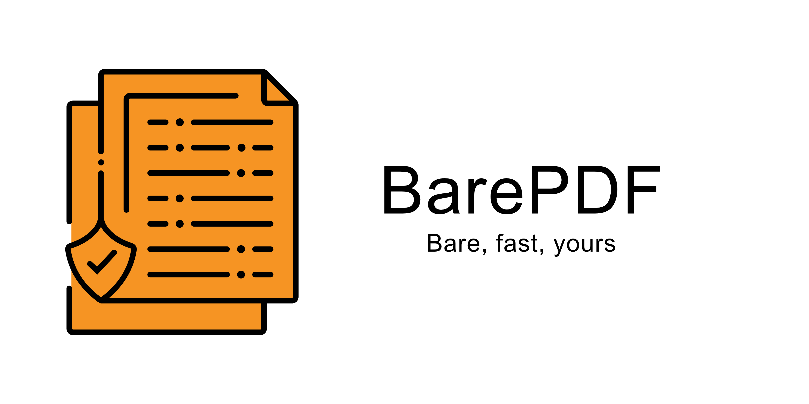
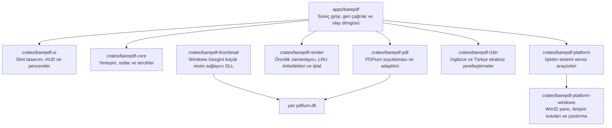

<a id="barepdf"></a>
<div align="center">
  <picture>
    <source media="(prefers-color-scheme: dark)" srcset="./assets/banner-dark.png">
    <source media="(prefers-color-scheme: light)" srcset="./assets/banner-white.png">
    
  </picture>

  <h1>BarePDF</h1>
  <p><strong>Windows 10 ve 11 için hızlı, özel ve hafif PDF okuyucu.</strong></p>

  [](https://github.com/Woffluon/BarePDF/releases/latest)
  [](https://github.com/Woffluon/BarePDF/actions/workflows/ci.yml)
  [](https://woffluon.github.io/BarePDF/docs/)
  [](#sistem-gereksinimleri)
  [](./LICENSE)

  [İndir](https://woffluon.github.io/BarePDF/download/) ·
  [Belgeler](https://woffluon.github.io/BarePDF/docs/) ·
  [Kıyaslama Raporu](./docs/BENCHMARKS.md) ·
  [Değişiklik günlüğü](https://woffluon.github.io/BarePDF/changelog/) ·
  [Hata bildir](https://github.com/Woffluon/BarePDF/issues/new) ·
  [Katkıda bulun](#katkida-bulunma)

  [English](README.md) · [Türkçe](README.tr.md)
</div>

---

BarePDF; Windows 10 ve 11 için Rust, Slint ve Google PDFium ile geliştirilen açık kaynaklı bir PDF okuyucudur. Belge işlemlerini yerel işlemcinizde tutar, doğrulanmış sıfır telemetri ilkesiyle çalışır ve belge uzunluğundan bağımsız olarak bellek kullanımını sınırlandıran talep odaklı işleme ve byte bütçeli LRU önbellekleri kullanır.

<a id="icerik"></a>
## İçindekiler

- [BarePDF neden?](#neden-barepdf)
- [Kurulum ve İndirme](#kurulum-ve-indirme)
- [Temel Özellikler](#temel-ozellikler)
- [Klavye Kısayolları](#klavye-kisayollari)
- [Mimari](#mimari)
- [Performans Kıyaslamaları](#performans-kiyaslamalari)
- [Sistem Gereksinimleri](#sistem-gereksinimleri)
- [Sıfır Telemetri ve Sürüm Güvenliği](#sifir-telemetri-ve-surum-guvenligi)
- [Geliştirici Rehberi](#gelistirici-rehberi)
- [Test](#test)
- [Paketleme ve Sürümler](#paketleme-ve-surumler)
- [Katkıda Bulunma](#katkida-bulunma)
- [Gizlilik ve Lisans](#gizlilik-ve-lisans)

<a id="neden-barepdf"></a>
## BarePDF neden?

| İlke | Teknik Karşılığı |
| --- | --- |
| **Tasarımla hızlı** | Öncelikli kuyruk mimarisi. Yalnızca görünür pencere alanı içindeki sayfalar rasterleştirilir; eski kaydırma işleri nesil belirteçleriyle anında iptal edilir. |
| **Sınırlandırılmış bellek** | Byte bütçeli LRU bitmap önbellekleri (32 MB ham, 16 MB arayüz, 4 MB küçük resim) 500+ sayfalık belgelerde bile bellek taşmasını önler. |
| **Sıfır telemetri** | %100 çevrimdışı. Sıfır analitik, sıfır takip kimliği, hesap zorunluluğu yok, okuma sırasında sıfır ağ araması. |
| **Yerel Windows entegrasyonu** | Yerel Win32 yazdırma, yüksek DPI desteği, Dosya Gezgini için küçük resim kabuk uzantısı ve standart Varsayılan Uygulamalar kaydı. |
| **Tam klavye kontrolü** | Hızlı Komut Paleti HUD (`Ctrl+K`), özel okuma modları ve tek tuşla erişilebilen kontroller. |
| **Kriptografik güvenlik** | Güncelleme bildirimleri Ed25519 ile imzalanır; indirilen paketler SHA-256 ve PE dosya sürümüyle doğrulanır. |

<a id="kurulum-ve-indirme"></a>
## Kurulum ve İndirme

BarePDF'i Windows Paket Yöneticisi (WinGet) ile kurabilir, bağımsız kurulum dosyasını çalıştırabilir veya kurulum gerektirmeyen taşınabilir arşivi kullanabilirsiniz.

### 1. Windows Paket Yöneticisi (WinGet)

PowerShell veya Windows Terminal üzerinden doğrudan kurun:

```powershell
winget install Woffluon.BarePDF
```

### 2. Windows Kurulum Dosyası (Setup Installer)

[Resmi indirme sayfasından](https://woffluon.github.io/BarePDF/download/) veya [GitHub Releases](https://github.com/Woffluon/BarePDF/releases/latest) üzerinden `BarePDF-Setup-x64-vX.Y.Z.exe` dosyasını indirin.

- Yönetici yetkisi gerektirmeden kullanıcı bazında kurulur.
- Varsayılan dizin: `%LOCALAPPDATA%\Programs\BarePDF`.
- Dosya uzantılarını Windows Varsayılan Uygulamalar ve "Birlikte Aç" menülerine temiz biçimde kaydeder.
- Yerel Windows Dosya Gezgini küçük resim sağlayıcı DLL dosyasını kaydeder.

### 3. Taşınabilir Arşiv (Portable ZIP)

Kurulum yapmadan çalıştırmak için `BarePDF-Portable-x64-vX.Y.Z.zip` dosyasını indirin.

- İstediğiniz klasöre veya USB belleğe çıkarın.
- `BarePDF.exe` dosyasını doğrudan çalıştırın.
- Kayıt defterine hiçbir anahtar yazmaz.

### Kriptografik Sağlama Doğrulaması

Her sürüm resmi `BarePDF-vX.Y.Z-SHA256SUMS.txt` dosyasını yayımlar. İndirdiğiniz kurulum dosyasının özetini PowerShell ile doğrulayın:

```powershell
$Installer = Get-Item .\BarePDF-Setup-x64-v*.exe
Get-FileHash -Algorithm SHA256 -LiteralPath $Installer.FullName
```

Elde edilen değeri yayımlanan bildirim dosyasındaki karşılığıyla eşleştirin.

> [!NOTE]
> Kurulum dosyası kasıtlı olarak ticari Authenticode sertifikasıyla imzalanmamıştır. Windows ilk çalıştırmada **Bilinmeyen yayımcı** istemi gösterebilir. Kriptografik doğruluk için SHA-256 sağlama değerini resmi bildirimle karşılaştırabilirsiniz.

<a id="temel-ozellikler"></a>
## Temel Özellikler

BarePDF masaüstü uygulamasında doğrudan yerleşik yedi temel özellik paketi sunar:

### 1. Birleştirme, Bölme, Sıralama ve Kırpma Araçları
- **PDF Birleştirme:** Birden fazla PDF belgesini dilediğiniz sırada tek bir dosyada birleştirin.
- **Sayfa Ayıklama ve Bölme:** Belirli sayfa aralıklarını (örn. `1-3, 5, 8-10`) ayıklayın veya belgeyi tek sayfalık parçalara bölün.
- **Görsel Sayfa Düzenleyici:** Sayfaları görsel olarak yeniden sıralayın, döndürün ve silin.
- **Kenar Boşluğu Kırpma:** Yazdırma veya küçük ekranlar için gereksiz beyaz alanları kırpma kutusu (`PageCropRect`) ile kesin.

### 2. Vektörel Not Alma ve İşaretleme Paketi
- **Metin Vurgulama (`Ctrl+H`):** PDFium glif vektör geometrisiyle desteklenen duyarlı metin vurgulamaları.
- **Vektörel El Çizimi:** Özel fırça renkleri, kalınlık ve eksiksiz geri alma/yineleme geçmişiyle (`Ctrl+Z`) serbest çizim yapın.
- **İmza Damgaları:** İmzalarınızı kaydedin ve piksel hassasiyetinde önizleme ile sayfalara damgalayın.
- **Daktilo Metin Notları:** Sayfa koordinatlarına doğrudan özel tipografik metin notları (`FreeTextAnnotation`) yerleştirin.
- **Kaydetme ve Dışa Aktarma:** Notları mevcut belgeye kaydedin (`Ctrl+S`) veya temiz bir kopyasını dışa aktarın (`Ctrl+Shift+S`).

### 3. Komut Paleti HUD (`Ctrl+K`)
- Klavyeden elinizi kaldırmadan `Ctrl+K` tuşlarına basarak baş üstü komut paletini açın.
- Sayfa numarasını yazarak doğrudan hedef sayfaya atlayın (örn. `42`).
- Komutları arayın, kâğıt tonlarını değiştirin, düzenleri seçin veya PDF araçlarını çalıştırın.

### 4. Dört Farklı Okuma Modu
- **Tek Sayfa:** Dikkati dağıtmayan, tek sayfaya odaklı görüntüleme.
- **Sürekli Dikey:** Dinamik sayfa ön yüklemesiyle akıcı, kesintisiz dikey kaydırma.
- **İki Sayfa Yan Yana:** Geniş ekranlar ve çift sütunlu yayınlar için yan yana görünüm.
- **Kitap Görünümü:** Kapak sayfasını hesaba katan, gerçek kitap düzenine uygun çift sayfa yerleşimi.
- **Sunum Modu (`F5`) ve Tam Ekran (`F11`):** Klavye geçişleriyle çerçevesiz, odaklanmış sunum deneyimi.

### 5. Göz Yormayan Kâğıt Tonları
- **Normal:** Standart net beyaz arka plan.
- **Sepya:** Uzun gündüz okumalarında göz yorgunluğunu azaltmak için tasarlanan sıcak kâğıt tonu.
- **Gece:** Düşük ışıklı ortamlar için düşük kontrastlı koyu kâğıt teması.
- **Kehribar:** Gece geç saatlerde ekran parlamasını önleyen yüksek sıcaklıklı kehribar tonu.
- **Ters Renk Modu (`Ctrl+I`):** Maksimum kontrastlı okuma için tam renk tersine çevirme.

### 6. Yerel Win32 Yazdırma ve Gezgin Küçük Resimleri
- **Yüksek Çözünürlüklü Yazdırma (`Ctrl+P`):** Yazdırma önizlemesi ile doğrudan Windows Win32 yazdırma kuyruğu üzerinden çıktı alın.
- **Dosya Gezgini Küçük Resimleri:** Windows Dosya Gezgini klasörlerinde PDF sayfalarının net önizlemelerini oluşturan 64 bit yerel kabuk uzantısı (`barepdf-thumbnail`).

### 7. Sıfır Telemetri ve %100 Çevrimdışı Güvencesi
- **Sıfır Ağ Trafiği:** Okuma motoru belgeleri açarken, görüntülerken, not eklerken veya düzenlerken kesinlikle sıfır ağ isteği yapar.
- **Analitik Yok:** Google Analytics yok, telemetri sinyali yok, izleme çerezleri veya aygıt kimliği yok.
- **Kullanıcı Hesabı Yok:** BarePDF e-posta, giriş yapma, bulut aboneliği veya lisans etkinleştirmesi istemez.
- **Gizliliğe Saygılı Güncellemeler:** Güncelleme denetimleri kullanıcı açıkça izin verene kadar bütünüyle devre dışıdır. Etkinleştirildiğinde yalnızca resmi GitHub Releases API uç noktalarına bağlanır.

<a id="klavye-kisayollari"></a>
## Klavye Kısayolları

| Kategori | Eylem | Birincil Kısayol | Alternatif Kısayol |
| :--- | :--- | :--- | :--- |
| **Dosya** | Belge aç | `Ctrl+O` | Sürükle ve bırak |
| **Dosya** | Notları kaydet | `Ctrl+S` | Araç çubuğu kaydet |
| **Dosya** | Notları farklı kaydet | `Ctrl+Shift+S` | Araç çubuğu dışa aktar |
| **Dosya** | Belgeyi yazdır | `Ctrl+P` | Araç çubuğu yazdır |
| **Gezinme** | Komut Paleti HUD | `Ctrl+K` | Araç çubuğu arama simgesi |
| **Gezinme** | Metin içinde bul | `Ctrl+F` | Araç çubuğu bul |
| **Gezinme** | Sonraki sayfa | `PageDown` veya `→` | `↓` veya `Space` (sunum) |
| **Gezinme** | Önceki sayfa | `PageUp` veya `←` | `↑` veya `Backspace` (sunum) |
| **Gezinme** | İlk sayfa | `Home` | |
| **Gezinme** | Son sayfa | `End` | |
| **Gezinme** | Yer işaretini değiştir | `Ctrl+D` | Kenar çubuğu yer işaretleri |
| **Görünüm** | Yakınlaştır | `+` veya `=` | `Ctrl++` |
| **Görünüm** | Uzaklaştır | `-` | `Ctrl+-` |
| **Görünüm** | Gerçek boyut (%100) | `Ctrl+0` | Araç çubuğu sığdırma menüsü |
| **Görünüm** | Saat yönünde döndür | `Ctrl+R` | Araç çubuğu döndür |
| **Görünüm** | Saatin tersine döndür | `Ctrl+Shift+R` | |
| **Görünüm** | Tam ekran | `F11` | |
| **Görünüm** | Sunum modu | `F5` | |
| **Görünüm** | Renkleri tersine çevir | `Ctrl+I` | Komut Paleti |
| **Notlar** | Metni vurgula | `Ctrl+H` | Sağ tık bağlam menüsü |
| **Notlar** | Çizimi / notu geri al | `Ctrl+Z` | Araç çubuğu geri al |
| **Genel** | Seçili metni kopyala | `Ctrl+C` | |
| **Genel** | Tüm metni seç | `Ctrl+A` | |
| **Genel** | Kapat / Moddan çık | `Esc` | |

<a id="mimari"></a>
## Mimari

BarePDF kullanıcı arayüzünü, temel geometrisini ve işleme motorunu modüler Rust crate'leri üzerinden ayırır:



| Bileşen | Sorumluluk |
| :--- | :--- |
| [`apps/barepdf`](./apps/barepdf) | Çalıştırılabilir giriş noktası, ayar yönetimi, olay döngüleri ve komut iletimi |
| [`crates/barepdf-core`](./crates/barepdf-core) | Etki alanı tipleri, koordinat hesapları, seçim mantığı, kırpma sınırları ve not modelleri |
| [`crates/barepdf-pdf`](./crates/barepdf-pdf) | Güvenli Rust bağlamaları ve Google PDFium işlemlerini yöneten aktör |
| [`crates/barepdf-render`](./crates/barepdf-render) | Öncelikli render kuyrukları, nesil iptali, uyarlamalı bellek bütçesi ve bitmap önbellekleri |
| [`crates/barepdf-ui`](./crates/barepdf-ui) | Slint arayüz bileşenleri, Komut Paleti HUD, araç panelleri ve tuval gösterimi |
| [`crates/barepdf-platform-windows`](./crates/barepdf-platform-windows) | Yerel Win32 yazdırma, pano, sürükle-bırak ve kayıt defteri entegrasyonu |
| [`crates/barepdf-thumbnail`](./crates/barepdf-thumbnail) | PDF küçük resimleri için COM kayıtlı 64 bit Windows Gezgini kabuk uzantısı |
| [`crates/barepdf-i18n`](./crates/barepdf-i18n) | İngilizce ve Türkçe için iki yönlü yerelleştirme tabloları |
| [`packaging/windows`](./packaging/windows) | Inno Setup paketleme yapılandırmaları ve WinGet bildirim oluşturucuları |
| [`website`](./website) | Statik Astro dokümantasyon sitesi ve sürüm meta veri entegrasyonu |

<a id="performans-kiyaslamalari"></a>
## Performans Kıyaslamaları

Ayrıntılı performans bulguları [`docs/BENCHMARKS.md`](./docs/BENCHMARKS.md) dosyasında belgelenmiştir.

- **Başlatma Gecikmesi:** Süreç başlangıcından aktif pencereye kadar 65 ms ile 95 ms (sıcak) ve 140 ms ile 190 ms (soğuk).
- **Yerleşik Bellek Kullanımı:** 28 MB ile 35 MB boşta çalışma kümesi; 500 sayfalık belgede 55 MB ile 72 MB.
- **LRU Tahliyesi:** Bellek kullanımı sayfa sayısıyla değil, byte bütçeleriyle sabit tutulur.
- **Ölçüm Script'i:** `powershell -File scripts/benchmark-memory-and-startup.ps1 -PdfPath <dosya> -Runs 5`.

<a id="sistem-gereksinimleri"></a>
## Sistem Gereksinimleri

| Özellik | Gereksinim |
| :--- | :--- |
| **İşletim Sistemi** | Windows 10 veya Windows 11 (yapı 19041 veya üzeri) |
| **Mimari** | 64 bit x86 (`x86_64`) |
| **Bellek** | En az 512 MB (1 GB önerilir) |
| **Disk Alanı** | Uygulama dosyaları ve PDFium çalışma zamanı için yaklaşık 50 MB |
| **Ağ** | Okuma için gerekmez; kullanıcı izinli güncelleme denetimleri için isteğe bağlı |

<a id="sifir-telemetri-ve-surum-guvenligi"></a>
## Sıfır Telemetri ve Sürüm Güvenliği

BarePDF tavizsiz bir gizlilik ve güvenlik standardı izler:

1. **Katı Çevrimdışı Çalışma:** Uygulama çalışırken sıfır giden ağ bağlantısı yapar.
2. **İsteğe Bağlı Güncelleme:** Otomatik güncelleme denetimleri tercihlerden açıkça izin verilene kadar kapalıdır.
3. **Kriptografik İmzalar:** Her sürüm Ed25519 ile imzalanmış `latest.json.sig` bildirimi yayımlar. Güncellemeler kurulum istemeden önce imzayı koda gömülü açık anahtarla doğrular.
4. **Doğrulama Zinciri:** İndirilen güncelleme paketleri URL, dosya boyutu, SHA-256 özeti ve dahili PE sürüm numarasıyla kontrol edilir.
5. **Sürüm Düşürme Engeli:** Güncelleyici sürüm düşürmeyi, aynı sürümün yeniden kurulmasını, güvenilmeyen yönlendirmeleri ve imzasız paketleri reddeder.

<a id="gelistirici-rehberi"></a>
## Geliştirici Rehberi

### Ön Koşullar

- x64 mimarisinde Windows 10 veya 11.
- [Rust](https://www.rust-lang.org/tools/install) 1.92 veya üzeri ve Cargo.
- Windows SDK ve C++ derleme araçlarıyla Visual Studio 2022 Build Tools.
- Site derlemesi için [Node.js](https://nodejs.org/) 22.12 veya üzeri ve pnpm 10.
- Yalnızca Windows kurulum paketi hazırlarken [Inno Setup 6](https://jrsoftware.org/isinfo.php).

### Masaüstü Uygulamasını Derleme ve Çalıştırma

```powershell
git clone https://github.com/Woffluon/BarePDF.git
cd BarePDF

# Sabitlenmiş ve SHA-256 ile doğrulanmış PDFium ikilisini indirin
powershell -File packaging/windows/scripts/fetch-pdfium.ps1 `
  -Destination target/debug/pdfium.dll

# Hata ayıklama derlemesini çalıştırın
cargo run --package barepdf
```

### Dokümantasyon Sitesini Çalıştırma

```powershell
pnpm --dir website install --frozen-lockfile
pnpm --dir website run dev
```

<a id="test"></a>
## Test

Depo kökünden tüm doğrulama adımlarını çalıştırın:

```powershell
cargo fmt --all --check
cargo clippy --workspace --all-targets --all-features --locked -- -D warnings
cargo test --workspace --all-features --locked
cargo audit --deny warnings

pnpm --dir website run test
pnpm --dir website exec astro check
pnpm --dir website run build
```

<a id="paketleme-ve-surumler"></a>
## Paketleme ve Sürümler

Ürün sürümlendirmesi yalnızca [`Cargo.toml`](./Cargo.toml) içindeki `[workspace.package].version` alanına dayanır. Tüm kurulum script'leri, manifestolar ve dokümantasyon bu tek kaynaktan türetilir.

### Yerel Paket Üretimi

```powershell
powershell -File packaging/windows/scripts/fetch-pdfium.ps1
powershell -File packaging/windows/scripts/stage-release.ps1
powershell -File packaging/windows/scripts/build-portable.ps1
powershell -File packaging/windows/scripts/build-installer.ps1
powershell -File packaging/windows/scripts/validate-installer.ps1
powershell -File packaging/windows/scripts/generate-checksums.ps1
powershell -File packaging/windows/scripts/generate-package-manifests.ps1
```

İmzasız derleme dosyaları `target/release/artifacts/` içine yazılır. GitHub Actions yayımlamadan önce kriptografik Ed25519 imzasını ekler.

<a id="katkida-bulunma"></a>
## Katkıda Bulunma

1. [`AGENTS.md`](./AGENTS.md) dosyasını ve [geliştirici belgelerini](https://woffluon.github.io/BarePDF/docs/developer/) okuyun.
2. `main` dalından odaklı bir özellik dalı açın.
3. Değişiklikleri net, yalın tutun ve otomatik testlerle destekleyin.
4. [Test](#test) bölümündeki tüm kontrolleri çalıştırın.
5. Conventional Commit formatında iletiler kullanın (`feat:`, `fix:`, `docs:`, vb.).
6. Değişiklik gerekçesini ve doğrulama çıktılarını belirten bir pull request açın.

- [Hata bildir](https://github.com/Woffluon/BarePDF/issues/new)
- [Sorunları incele](https://github.com/Woffluon/BarePDF/issues)
- [Pull request gönder](https://github.com/Woffluon/BarePDF/pulls)

<a id="gizlilik-ve-lisans"></a>
## Gizlilik ve Lisans

- Belge okuma sürecinde sıfır telemetri, sıfır analitik, sıfır dış ağ bağlantısı.
- [MIT Lisansı](./LICENSE) ile dağıtılır.
- Üçüncü taraf lisans ve bildirimleri [`THIRD_PARTY_NOTICES.md`](./THIRD_PARTY_NOTICES.md) içinde listelenmiştir.

Şüpheli güvenlik açıklarını [GitHub Security Advisories](https://github.com/Woffluon/BarePDF/security/advisories/new) üzerinden özel olarak bildirin.

---

<div align="center">
  <strong>Sade. Hızlı. Senin.</strong><br>
  <a href="#barepdf">Başa dön ↑</a>
</div>
